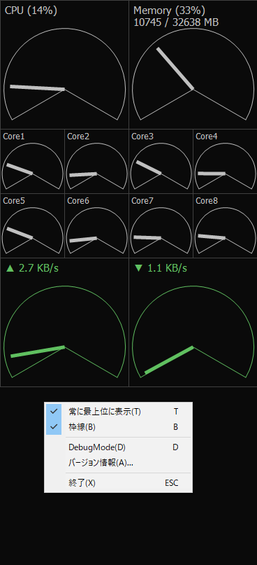

# CompactMeter

Windows用のCPU使用率やネット通信量をメーター表示するウィジェットっぽいツールです。

## 操作方法

| 操作 | 説明 |
| --- | --- |
| ウィンドウをドラッグ | 移動 |
| Shiftキーを押しながらドラッグ | サイズ変更(暫定) |
| ESCキー、F12キー | 終了 |
| Dキー | デバッグモード切替 |
| Tキー | 「常に最上位に表示」切替 |
| Bキー | 枠線表示の切替 |

## ダウンロード

- まだ正式リリースはしていません。するかどうかも未定です。
- [AppVeyorのartifacts](https://ci.appveyor.com/project/takke/compactmeter/build/artifacts) から最新版(スナップショット)をダウンロードできます。
