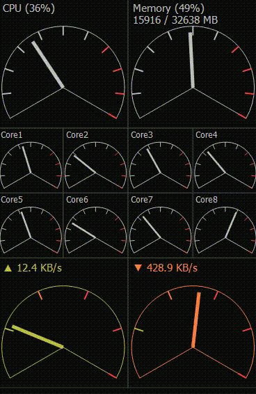

# CompactMeter

Windows用のCPU使用率やネット通信量をメーター表示するウィジェットっぽいツールです。

Direct2D 対応なのでCPU負荷を低く抑えています。

## ダウンロード

- [Releases](https://github.com/takke/CompactMeter/releases) からダウンロードできます。
- [AppVeyorのartifacts](https://ci.appveyor.com/project/takke/compactmeter/build/artifacts) から最新版(スナップショット)をダウンロードできます。

## 対応OS

- Windows7, Windows8.1, Windows10

- Visual C++ 2017 ランタイムが必要
  - [Visual Studio 2017 用 Microsoft Visual C\+\+ 再頒布可能パッケージ](https://support.microsoft.com/ja-jp/help/2977003/the-latest-supported-visual-c-downloads)

## 操作方法

- `CompactMeter.exe` (32ビット版) または `CompactMeter_64.exe` (64ビット版) を起動してください。

| 操作 | 説明 |
| --- | --- |
| ウィンドウをドラッグ | 移動 |
| Shiftキーを押しながらドラッグ | サイズ変更 |
| 右クリック | メニュー表示 |
| ESCキー、F12キー | 終了 |
| Tキー | 「常に最上位に表示」切替 |
| Bキー | 枠線表示の切替 |
| Dキー | デバッグモード切替 |

## 変更履歴

### v1.3.0 (2019.01.xx)
- ウィンドウの移動時にデスクトップからはみ出さないようにした
- ESCキーでウィンドウを閉じる設定を追加
- その他

### v1.2.0 (2019.01.18)
- 実行ファイルにデジタル署名するようにした
- 背景色変更機能を追加
- ドライブのメーターを各ドライブ単位でOn/Offできるように変更
- 自動起動設定を追加
- タスクトレイアイコンクリックで表示・非表示切替
- その他

### v1.1.0 (2019.01.02)
- メーター設定を追加(メーターの順序変更、各メーターの表示/非表示に対応)
- 64ビット版バイナリを同梱
- メーターの列数設定を追加
- ドライブのI/Oメーター追加
- コア別メーター設定を削除(メーター設定に統合)
- ウィンドウの最小サイズを 300x300 -> 200x200 に変更
- その他

### v1.0.0 (2018.12.27)

- 初版リリース

## 開発メモ

### 前提
- 開発環境: Visual Studio Community 2017
- OS: Windows 10 Pro 64bit
- 7-Zip (64bit版)
- デジタル署名する場合：コード証明書がインストール済みであること

### リリース作業

- 下記を順に実行する
  - `100_build_exe.bat`
  - `200_packaging.bat`
- `packaging` 内の各ファイルがデジタル署名済みであることを確認する
- `packaging/CompactMeter_vXXX.zip` をリネームし GitHub の Releases にアップロードする
